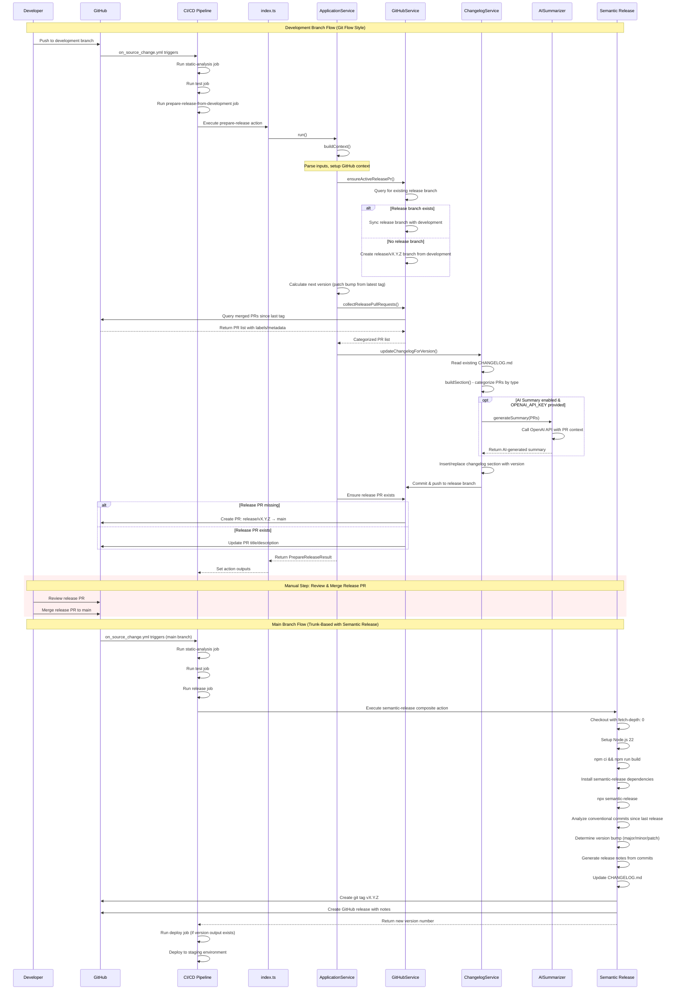

# Architecture

## Components

| Component | Role |
| --------- | ---- |
| `ApplicationService` | Orchestrates end-to-end flow. |
| `GithubService` | GitHub GraphQL/REST operations: PR discovery/creation, label management, PR listing, tag inspection. |
| `ChangelogService` | Builds structured changelog section and commits changes. |
| `AISummarizer` | Optional AI summary generation. |
| `types.ts` | Shared type contracts. |
| `index.ts` | Entrypoint; sets outputs & error handling. |

## Workflow Diagrams

### Development & Release Workflow

```mermaid
graph TD
    %% Trunk-Based Development (Main Branch)
    subgraph "Trunk-Based Development → Main Branch"
        A[Developer Starts Work]
        A --> A1{Use Feature Branch?}
        
        %% Feature Branch Path
        A1 -->|Yes - Complex/Collaborative| B[Create Feature Branch]
        B --> C[Write Failing Tests TDD]
        C --> D[Implement Code]
        D --> E[Conventional Commit]
        E --> F[Push Feature Branch]
        F --> G[Create PR to Main]
        G --> H{Static Analysis & Tests Pass?}
        H -->|No| I[Fix Issues]
        I --> E
        H -->|Yes| J[Code Review]
        J --> K{Review Approved?}
        K -->|No| L[Address Feedback]
        L --> E
        K -->|Yes| M[Squash & Merge to Main]
        
        %% Direct Commit Path
        A1 -->|No - Simple/Solo| N[Work Directly on Main]
        N --> O[Write Failing Tests TDD]
        O --> P[Implement Code]
        P --> Q[Conventional Commit]
        Q --> R[Push Directly to Main]
        R --> S[CI Validates Post-Commit]
        S --> T{CI Success?}
        T -->|No| U[Fix & Push Hotfix]
        U --> Q
        T -->|Yes| V[Continue to Release]
        
        %% Convergence
        M --> W[on_source_change.yml Triggers]
        V --> W
        W --> X[Static Analysis Job]
        X --> Y[Test Job]
        Y --> Z[Release Job - Semantic Release]
        Z --> AA[Checkout with Full History]
        AA --> BB[Setup Node.js 22]
        BB --> CC[npm ci && npm run build]
        CC --> DD[Install Semantic Release Deps]
        DD --> EE[Run semantic-release]
        EE --> FF[Analyze Commits]
        FF --> GG[Generate Version & CHANGELOG]
        GG --> HH[Create Git Tag]
        HH --> II[Publish GitHub Release]
        II --> JJ[Deploy Job Triggers]
        JJ --> KK[Deploy to Staging]
    end

    %% Git Flow Development Branch
    subgraph "Git Flow → Development Branch"
        LL[Developer Creates Feature Branch] --> MM[Write Failing Tests TDD]
        MM --> NN[Implement Code]
        NN --> OO[Conventional Commit]
        OO --> PP[Push Feature Branch]
        PP --> QQ[Create PR to Development]
        QQ --> RR{Static Analysis & Tests Pass?}
        RR -->|No| SS[Fix Issues]
        SS --> OO
        RR -->|Yes| TT[Code Review]
        TT --> UU{Review Approved?}
        UU -->|No| VV[Address Feedback]
        VV --> OO
        UU -->|Yes| WW[Squash & Merge to Development]
        WW --> XX[on_source_change.yml Triggers]
        XX --> YY[Static Analysis Job]
        YY --> ZZ[Test Job]
        ZZ --> AAA[Prepare Release Job]
        AAA --> BBB[prepare-release-action Runs]
        BBB --> CCC[ApplicationService.buildContext]
        CCC --> DDD[GithubService.ensureActiveReleasePr]
        DDD --> EEE{Release Branch Exists?}
        EEE -->|No| FFF[Create Release Branch]
        EEE -->|Yes| GGG[Sync Release Branch]
        FFF --> HHH[Calculate Next Patch Version]
        GGG --> HHH
        HHH --> III[collectReleasePullRequests]
        III --> JJJ[ChangelogService.updateChangelog]
        JJJ --> KKK{AI Summary Enabled?}
        KKK -->|Yes| LLL[AISummarizer.generateSummary]
        KKK -->|No| MMM[Categorize Changes]
        LLL --> MMM
        MMM --> NNN[Insert/Replace Changelog Section]
        NNN --> OOO[Commit & Push to Release Branch]
        OOO --> PPP{Release PR Exists?}
        PPP -->|No| QQQ[Create Release PR to Main]
        PPP -->|Yes| RRR[Update Release PR]
        QQQ --> SSS[Manual Review & Merge]
        RRR --> SSS
        SSS -.->|When merged| W
    end

    %% Styling
    classDef trunkBased fill:#e3f2fd,stroke:#0277bd,stroke-width:2px
    classDef trunkDirect fill:#e1f5fe,stroke:#0288d1,stroke-width:3px
    classDef gitFlow fill:#f3e5f5,stroke:#7b1fa2,stroke-width:2px
    classDef cicdJob fill:#e8f5e8,stroke:#388e3c,stroke-width:2px
    classDef decision fill:#fff3e0,stroke:#f57c00,stroke-width:2px
    classDef semanticRelease fill:#ffebee,stroke:#c62828,stroke-width:2px
    classDef prepareRelease fill:#fce4ec,stroke:#ad1457,stroke-width:2px

    class A,B,C,D,E,F,M trunkBased
    class N,O,P,Q,R,S,U,V trunkDirect
    class LL,MM,NN,OO,PP,QQ,WW gitFlow
    class W,X,Y,Z,XX,YY,ZZ,AAA cicdJob
    class A1,H,K,T,RR,UU,EEE,KKK,PPP decision
    class AA,BB,CC,DD,EE,FF,GG,HH,II semanticRelease
    class BBB,CCC,DDD,FFF,GGG,HHH,III,JJJ,MMM,NNN,OOO,QQQ,RRR prepareRelease
```



### Action Internal Sequence (Detailed)



## Version Strategy

Let latest tag = `vA.B.C`. Next version = `A.B.(C+1)`. Major/minor changes require external tooling or manual override (future ADR).

## Changelog Section Structure

```markdown
## [version] - YYYY-MM-DD

### AI Summary (optional)
<summary bullets>

### Added

- item (#PR)

### Changed

... details ...

### Fixed

... details ...

### Breaking changes

... details ...
```

Replacement uses a regex anchored to existing `## [<version>]` block.

## Error Handling

- Merge conflicts logged with a warning.
- AI failures do not abort.
- Missing repository/refs produce thrown errors (fail fast).

## Extensibility Points

| Area | Potential Extension |
| ---- | ------------------- |
| Version policy | Support conventional commit-based semver bump. |
| Changelog parsing | Parse PR body standardized template. |
| AI model | Configurable model & prompt customization. |
| Label taxonomy | Multi-label classification for changelog categories. |

## Non-Goals

- Publishing releases (delegated to semantic-release).
- Semantic diffing of code changes.
- Multi-repo release orchestration.

## Risks

| Risk | Impact | Mitigation |
| ---- | ------ | ---------- |
| Regex replacement edge cases | Corrupt changelog | Unit tests around insertion logic (to add). |
| API rate limits | Partial data | Pagination implemented; could add backoff. |
| Inconsistent PR body formatting | Category misclassification | Fallback generic category heuristic. |

See ADRs for decisions influencing this design.
